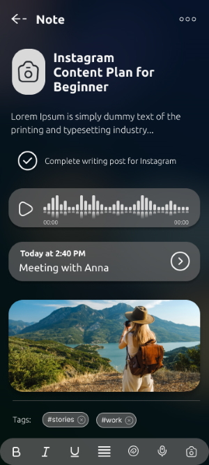

Writer.Me is an extended notes app and bookmarks manager developed using [Jetpack Compose](https://developer.android.com/jetpack/compose), [Material Design](https://m2.material.io/) and [Realm Kotlin](https://github.com/realm/realm-kotlin)

The note is developed in the Jupiter Notebook style, where each block can be edited separately. 
It allows to keep the history of changes made to each block of the note.

The list of the supported features:
- Making notes, which might include:
    - cover images
    - text
    - voice and audio files
    - images
    - checkboxes
    - links
    - tasks
- Changes history support: number of changes stored for each type of block can be set or adjusted in Settings.
- Bookmarks Manager: allows to store and manage bookmarks and organize them into separate folders.

Some screenshots of the app interface: 

  

© 2023 Andrii Dubovyk
